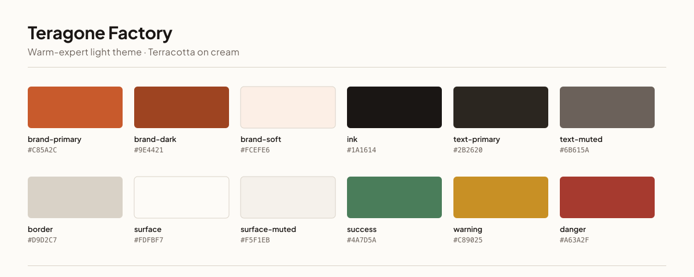
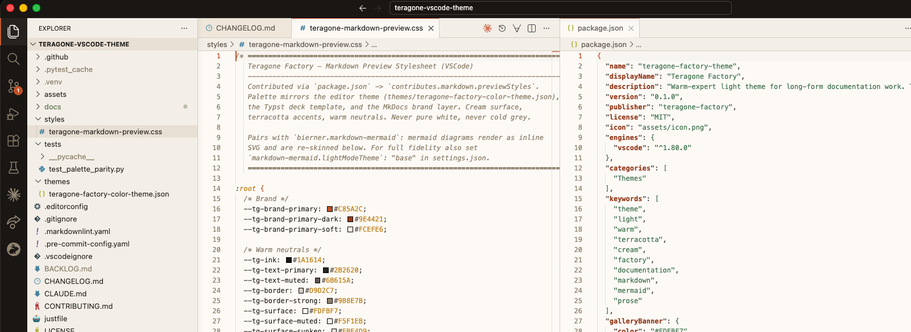
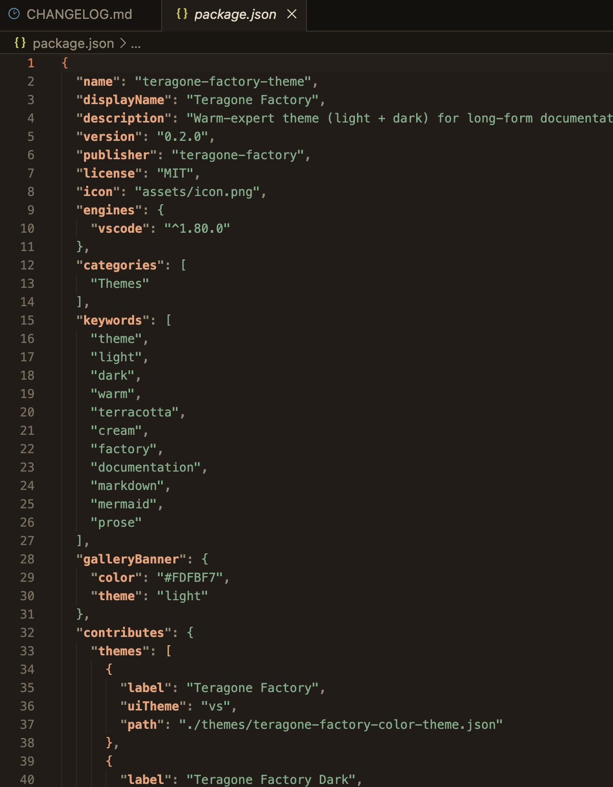
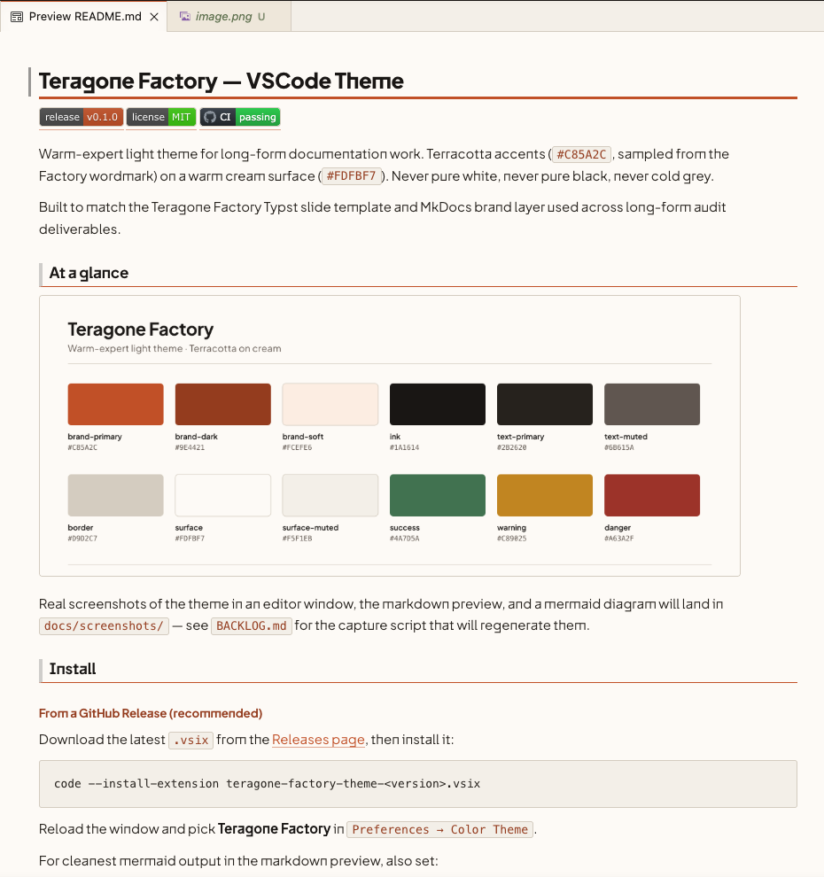
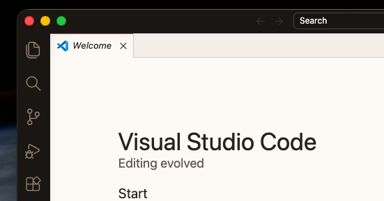
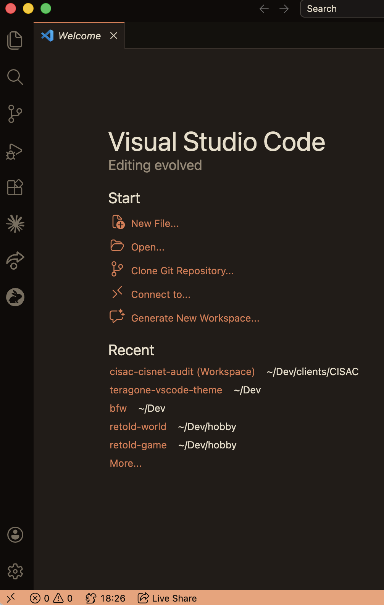

# Teragone Factory — VSCode Theme

[](https://github.com/Teragone-Factory/teragone-vscode-theme/releases)
[](./LICENSE)
[](https://github.com/Teragone-Factory/teragone-vscode-theme/actions/workflows/ci.yml)

Warm-expert theme for long-form documentation work, in two surfaces:

- **Teragone Factory** — terracotta (`#C85A2C`) on warm cream
  (`#FDFBF7`). The original.
- **Teragone Factory Dark** — lifted terracotta (`#E07A4F`) on warm
  fired-clay dark (`#221C18`). Same brand, evening shift.

Both sample the brand primary from the Factory wordmark. Never pure
white, never pure black, never cold grey.

Built to match the Teragone Factory Typst slide template and MkDocs brand
layer used across long-form audit deliverables.

## At a glance



### In the editor





### In the markdown preview



### Workbench chrome





## Install

### From a GitHub Release (recommended)

Download the latest `.vsix` from the
[Releases page](https://github.com/Teragone-Factory/teragone-vscode-theme/releases/latest),
then install it:

```bash
code --install-extension teragone-factory-theme-<version>.vsix
```

Reload the window and pick **Teragone Factory** (light) or
**Teragone Factory Dark** in `Preferences → Color Theme`.

For cleanest mermaid output in the markdown preview, also set:

```jsonc
// .vscode/settings.json or user settings
{
  "markdown-mermaid.lightModeTheme": "base"
}
```

### VS Marketplace / Open VSX

Publishing to the public registries is tracked separately (see `BACKLOG.md`).
For now, install from the Releases page above.

### From source (development)

```bash
git clone https://github.com/Teragone-Factory/teragone-vscode-theme.git
cd teragone-vscode-theme
just install-local   # symlinks into ~/.vscode/extensions/
```

Edit the JSON, run `Developer: Reload Window` in VSCode to pick up changes —
no rebuild required when symlinked. See [CONTRIBUTING.md](./CONTRIBUTING.md)
for the full dev loop.

## Palette

The brand carries 12 semantic tokens. Each surface (light, dark) maps the
same role to the hex tuned for that context. The light palette below also
drives the markdown-preview stylesheet (which stays cream regardless of
editor theme — consistent with the MkDocs site).

### Light palette

<!-- palette:start -->

| Token           | Hex       | Role                                  |
|-----------------|-----------|---------------------------------------|
| brand-primary   | `#C85A2C` | Accents, status bar, selection, links |
| brand-dark      | `#9E4421` | Keywords, hover                       |
| brand-soft      | `#FCEFE6` | Hover backgrounds                     |
| ink             | `#1A1614` | Title bar, activity bar               |
| text-primary    | `#2B2620` | Foreground                            |
| text-muted      | `#6B615A` | Secondary text                        |
| border          | `#D9D2C7` | Panel borders                         |
| surface         | `#FDFBF7` | Editor background                     |
| surface-muted   | `#F5F1EB` | Sidebar / panel background            |
| success         | `#4A7D5A` | Strings                               |
| warning         | `#C89025` | Numbers, modified                     |
| danger          | `#A63A2F` | Errors                                |

<!-- palette:end -->

### Dark palette

Same roles, retuned for a dark workshop. Brand hue is preserved across
both surfaces; lightness and chroma shift per OKLCH discipline so the
terracotta reads cleanly without going garish, and surfaces stay warm
fired-clay (never cold grey, never pitch-black). In dark mode `brand-dark`
is the *brighter* terracotta — keywords and hover lift up against the
surface rather than down.

<!-- palette-dark:start -->

| Token           | Hex       | Role                                  |
|-----------------|-----------|---------------------------------------|
| brand-primary   | `#E07A4F` | Accents, status bar, selection, links |
| brand-dark      | `#F2A075` | Keywords, hover (lifts brighter)      |
| brand-soft      | `#3A2218` | Hover backgrounds (ember glow)        |
| ink             | `#0F0B09` | Title bar, activity bar               |
| text-primary    | `#E8DDC9` | Foreground                            |
| text-muted      | `#998A77` | Secondary text                        |
| border          | `#3A312A` | Panel borders                         |
| surface         | `#221C18` | Editor background (fired clay)        |
| surface-muted   | `#1A1612` | Sidebar / panel background (sunken)   |
| success         | `#7AAE89` | Strings                               |
| warning         | `#E5B062` | Numbers, modified                     |
| danger          | `#E5705A` | Errors                                |

<!-- palette-dark:end -->

Both tables above are the canonical source of truth for their respective
brand surfaces. Derived neutral shades used internally by the themes
(e.g. `#9B8E7B` / `#7A6E5E` for line numbers, `#EBE4D9` / `#14110D` for
sidebar section headers) are intentionally not listed — they are tuned
in-context and should not be reused as primary brand colors. The CI
parity test asserts that every canonical hex appears in its theme JSON,
and that every light-palette hex also appears in the markdown-preview
CSS.

## Contributing

See [CONTRIBUTING.md](./CONTRIBUTING.md) for the local dev loop, palette
discipline rules, and release flow. Issue templates distinguish palette
*hex* requests (brand-locked, rarely accepted) from *role* tweaks (fair
game).

## License

MIT.
