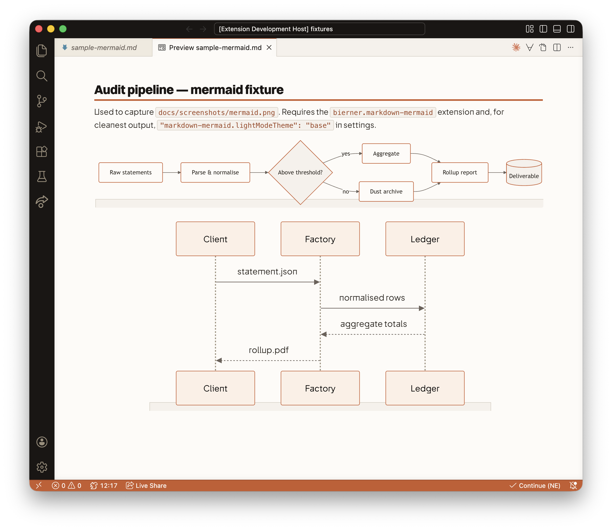

# Teragone Factory — VSCode Theme

[](https://github.com/Teragone-Factory/teragone-vscode-theme/releases)
[](./LICENSE)
[](https://github.com/Teragone-Factory/teragone-vscode-theme/actions/workflows/ci.yml)

Warm-expert light theme for long-form documentation work. Terracotta accents
(`#C85A2C`, sampled from the Factory wordmark) on a warm cream surface
(`#FDFBF7`). Never pure white, never pure black, never cold grey.

Built to match the Teragone Factory Typst slide template and MkDocs brand
layer used across long-form audit deliverables.

## Screenshots




## Install

### From a GitHub Release (recommended)

Download the latest `.vsix` from the
[Releases page](https://github.com/Teragone-Factory/teragone-vscode-theme/releases/latest),
then install it:

```bash
code --install-extension teragone-factory-theme-<version>.vsix
```

Reload the window and pick **Teragone Factory** in
`Preferences → Color Theme`.

For cleanest mermaid output in the markdown preview, also set:

```jsonc
// .vscode/settings.json or user settings
{
  "markdown-mermaid.lightModeTheme": "base"
}
```

### VS Marketplace / Open VSX

Publishing to the public registries is tracked separately (see `BACKLOG.md`).
For now, install from the Releases page above.

### From source (development)

```bash
git clone https://github.com/Teragone-Factory/teragone-vscode-theme.git
cd teragone-vscode-theme
just install-local   # symlinks into ~/.vscode/extensions/
```

Edit the JSON, run `Developer: Reload Window` in VSCode to pick up changes —
no rebuild required when symlinked. See [CONTRIBUTING.md](./CONTRIBUTING.md)
for the full dev loop.

## Palette

<!-- palette:start -->

| Token           | Hex       | Role                                  |
|-----------------|-----------|---------------------------------------|
| brand-primary   | `#C85A2C` | Accents, status bar, selection, links |
| brand-dark      | `#9E4421` | Keywords, hover                       |
| brand-soft      | `#FCEFE6` | Hover backgrounds                     |
| ink             | `#1A1614` | Title bar, activity bar               |
| text-primary    | `#2B2620` | Foreground                            |
| text-muted      | `#6B615A` | Secondary text                        |
| border          | `#D9D2C7` | Panel borders                         |
| surface         | `#FDFBF7` | Editor background                     |
| surface-muted   | `#F5F1EB` | Sidebar / panel background            |
| success         | `#4A7D5A` | Strings                               |
| warning         | `#C89025` | Numbers, modified                     |
| danger          | `#A63A2F` | Errors                                |

<!-- palette:end -->

The table above is the canonical source of truth for the brand palette.
Derived neutral shades used internally by the theme (e.g. `#9B8E7B` for
line numbers, `#EBE4D9` for sidebar section headers) are intentionally
not listed here — they are tuned in-context and should not be reused as
primary brand colors. The CI parity test asserts that every token listed
above appears in both the theme JSON and the markdown-preview CSS.

## Contributing

See [CONTRIBUTING.md](./CONTRIBUTING.md) for the local dev loop, palette
discipline rules, and release flow. Issue templates distinguish palette
*hex* requests (brand-locked, rarely accepted) from *role* tweaks (fair
game).

## License

MIT.
