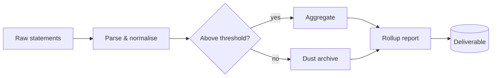
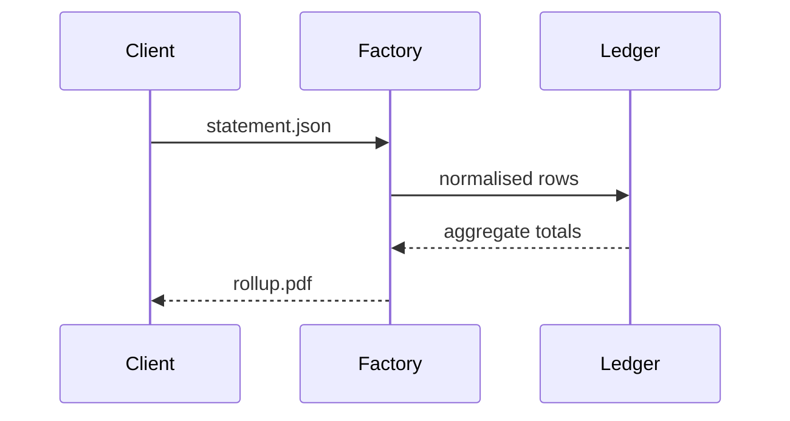

# Audit pipeline — mermaid fixture

Used to capture `docs/screenshots/mermaid.png`. Requires the
`bierner.markdown-mermaid` extension and, for cleanest output,
`"markdown-mermaid.lightModeTheme": "base"` in settings.

