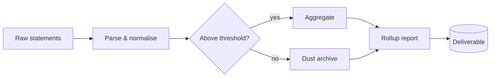
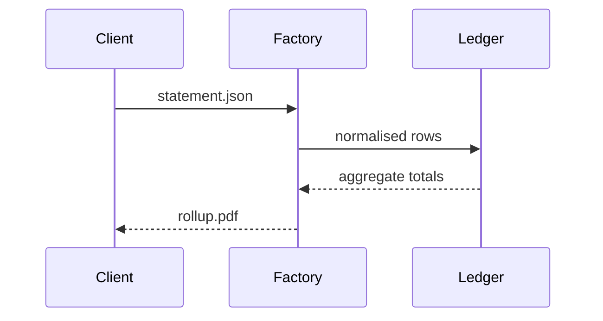

# Audit pipeline — mermaid fixture

Used to capture `docs/screenshots/mermaid.png`. Requires mermaid preview
support — built into VS Code ≥ 1.123 (`mermaid-markdown-features`); on
older versions, the now-deprecated `bierner.markdown-mermaid` extension
(don't keep both, see README). For cleanest output, set
`"markdown-mermaid.lightModeTheme": "base"` in settings.

```mermaid
flowchart LR
    I[Raw statements] --> P[Parse & normalise]
    P --> T{Above threshold?}
    T -->|yes| A[Aggregate]
    T -->|no| D[Dust archive]
    A --> R[Rollup report]
    D --> R
    R --> O[(Deliverable)]
```

```mermaid
sequenceDiagram
    participant C as Client
    participant F as Factory
    participant L as Ledger
    C->>F: statement.json
    F->>L: normalised rows
    L-->>F: aggregate totals
    F-->>C: rollup.pdf
```
